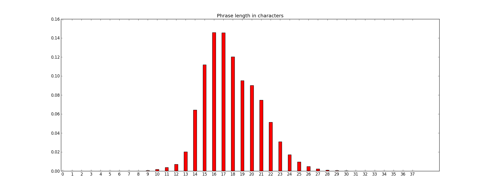

### Dictionary

Total number of words: 54813

|       | 1   | 2   | 3    | 4    | 5    | 6+   | Sum   |
| ----- | --- | --- | ---- | ---- | ---- | ---- | ----: |
| Verb  | 16  | 238 | 1243 | 2556 | 2864 | 3081 | 9998  |
| Adj   | 16  | 247 | 1711 | 4557 | 5020 | 6541 | 18092 |
| Noun  | 16  | 256 | 2575 | 7926 | 8144 | 7806 | 26723 |

Available pleonasm words by length of hex-input. For example, of the possible 16^3 = 4096 hex keys of length 3, the noun-dictionary covers 2575, or 63%.

### Pleonasm phrases

Pleonasm phrases are around 2.6 times as long as the hex input (this counts characters as well as the separating spaces and commas).

| Hex length | Avg. words | Avg. phrase length | Factor |
| ---------- | ---------- | ------------------ | ------ |
| 1          | 1.0        | 4.0                | 4.0    |
| 2          | 1.066      | 4.875              | 2.44   |
| 3          | 1.657      | 8.36               | 2.79   |
| 4          | 2.004      | 10.44              | 2.61   |
| 5          | 2.415      | 12.95              | 2.59   |
| 6          | 2.807      | 15.41              | 2.57   |
| 7          | 3.14       | 17.89              | 2.56   |
| 8          | 3.56       | 21.04              | 2.63   |
| 10         | 4.417      | 26.815             | 2.68   |
| 16         | 6.785      | 42.502             | 2.66   |
| 20         | 8.426255   | 53.126             | 2.66   |
| 40         | 16.415488  | 106.519            | 2.66   |

For the hex lengths <= 7, all possible values were computed. For length 8 and over, a million random samples were chosen each.

#### Phrase length of 7

Given an input hex number of length 7, the pleonasm phrase length will distributed as follows:

